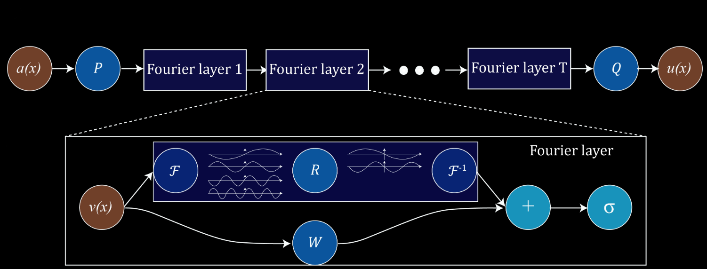

# Fourier Neural Operator in JAX
Simple implementation of Fourier Neural Operators (FNOs) in the JAX deep learning framework.

This is a simple tutorial that follows the original publication of [Li et
al.](https://arxiv.org/abs/2010.08895) to train a neural operator to predict the
state of a Burgers simulation in the future given the initial state.

📺 [Here](https://youtu.be/74uwQsBTIVo) you can find a video with detailed explanations to code along.

💽 Want more Machine Learning & Simulation. Check out the
[repo](https://github.com/Ceyron/machine-learning-and-simulation) with more codes and handwritten notes.

### About FNOs

Fourier Neural Operators belong to the stream of research on neural operators.
Neural operators are mappings between (discretized) function spaces. For
example, this can be a mapping from an initial state to a later point in time,
or from a parametric field to the solution of a stationary problem.

In that sense, FNOs are image-to-image architectures that have a ResNet like
architecture, but employ spectral convolutions. These operate in Fourier space
(hence the name) and give FNOs a global view on the domain. This is crucial,
because elliptic PDEs are often global (the intial state in the end of the
domain affects the solution in the other end).